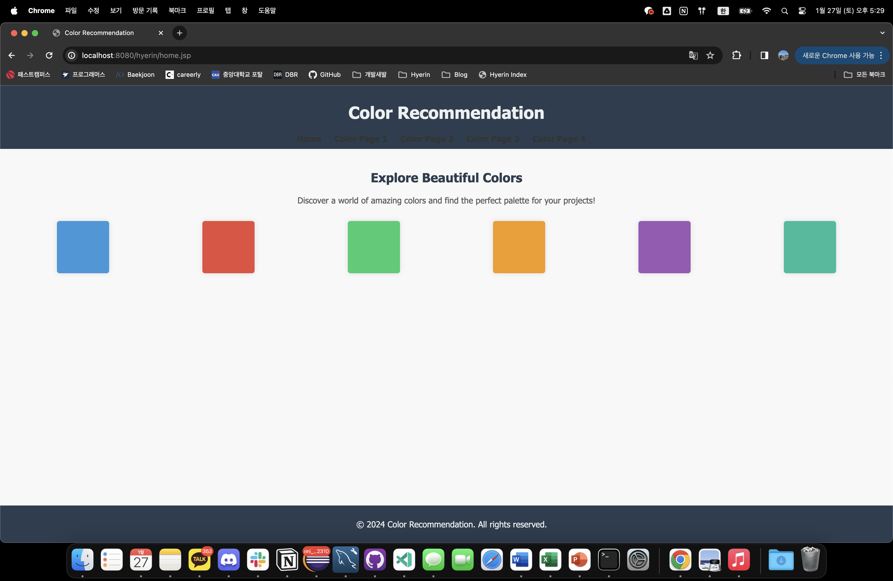

### :small_orange_diamond: 📢 color 추천 사이트 구성하기

### :small_orange_diamond: 🙋‍♂️팀원

  - <a href="https://github.com/myeongjjj" target="_blank">김명주</a>
  - <a href="https://github.com/HyekJung" target="_blank">김혜정</a>                                    
  - <a href="https://github.com/Igu-ri" target="_blank">이규휘</a>
  - <a href="https://github.com/nahyerin" target="_blank">나혜린</a> 
  

### :small_orange_diamond: 📆 프로젝트 기간

2024.01.20. ~ 2024.01.26.

| 기간                 | 설명                                                         |
| ------------------- | ------------------------------------------------------------|
| 1.20(토) ~ 1.20(토)  | 전체 회의 (주제선정 및 일정조율)                                   |
| 1.22(월) ~ 1.24(수)  | 코드 작성 및 협업기능 공부                                        |
| 1.25(목) ~ 1.26(금)  | 전체페이지 병합 및 결과물 확인                                     |

  

### :small_orange_diamond: 📍개발 환경

  

### :small_orange_diamond: 🥁구현 기능 목록
* 메인페이지
  - home
     + 각 메뉴로 넘어갈 수 있는 첫 화면 (Home)
* 색깔제안페이지
  - 각자가 생각하는 컬러를 활용한 페이지기능을 구현
  - 주 목적은 협업하기였으므로 큰 틀을 건들지 않고 각자 기능을 붙이는 것에 대한 경험
  
  

### :small_orange_diamond: 🎯구현 결과
#### 0) Home

    
#### 1) colorpage1
.png)
  
.png)

    

#### 2) colorpage2
.png)
  
.png)

    

#### 3) colorpage3
.png)
  
.png)

    

#### 4) colorpage4
.png)
  
.png)

  

